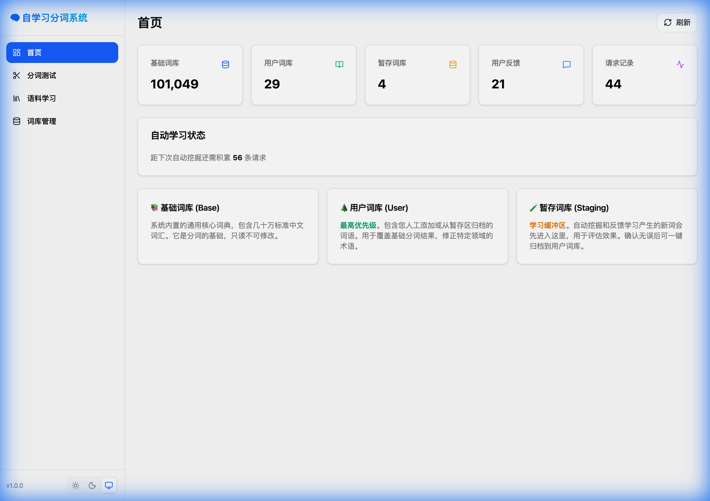

# 自学习中文分词系统

一个具备**自我学习**和**持续进化**能力的中文分词系统。

## ✨ 特性

- **基础分词**：双向最大匹配算法 + HMM 处理未登录词
- **三层词库体系**：基础词库 + 用户词库 + 暂存词库，支持灰度发布新词
- **新词发现**：基于互信息和左右熵的自动新词挖掘
- **用户反馈**：收集用户纠正，自动提取新词
- **动态更新**：词典实时热更新，无需重启
- **Web 界面**：内置现代化 React 前端，支持可视化分词测试与管理



## 📁 项目结构

```
seg/
├── cmd/
│   ├── server/           # HTTP 服务入口
│   └── train_hmm/        # HMM 模型训练工具
├── pkg/
...
└── data/
    ├── dict/             # 词典文件
    └── model/            # HMM 模型文件
```

### 方式一：直接运行 (Makefile)
提供了便捷的 Makefile 指令：

```bash
# 构建前端 + 后端
make build

# 运行服务 (访问 http://localhost:8080)
make run

# 仅训练 HMM 模型
make train

# 清理构建
make clean
```

### 方式二：手动运行
```bash
# 启动服务 (自动加载 web/dist 静态资源)
go run cmd/server/main.go

# 仅启动 API 服务 (不加载前端)
go run cmd/server/main.go -web=false
```

服务启动后，**API 接口** 与 **Web 界面** 均监听 `8080` 端口，实现真正的单体部署。
## 📦 组件调用 (Go)

如果您希望在现有的 Go 项目中直接集成：

```go
package main

import (
	"fmt"

	"github.com/teatak/seg/pkg/dict"
	"github.com/teatak/seg/pkg/seg"
)

func main() {
	// 1. 初始化词典 (基础词典 + 用户词典 + 暂存词典)
	d := dict.NewDictionary("./data/dict/base.txt", "./data/dict/user.txt", "./data/dict/staging.txt")
	if err := d.Load(); err != nil {
		panic(err)
	}

	// 2. 初始化 HMM 模型 (用于新词识别)
	hmm := seg.NewDefaultHMM()

	// 3. 创建分词器
	// useStaging=true 表示启用暂存词典 (适合开发/评估模式)
	segmenter := seg.NewSegmenter(d, hmm, true)

	// 4. 执行分词
	text := "人工智能正在改变世界"
	tokens := segmenter.Segment(text)

	// 5. 输出结果
	for _, token := range tokens {
		fmt.Printf("%s\t[%s]\n", token.Word, token.Type)
	}
}
```

### 集成到现有 HTTP 服务 (Gin/Echo/Stdlib)

系统提供了标准的 HTTP Handler，可以轻松注册到您现有的 Web 服务中。

#### 1. 标准库集成

分词组件自带了一个 React 前端界面 (构建产物在 `web/dist`)。
`RegisterFrontend` 方法会自动注册静态文件服务，并处理 SPA 路由 fallback，同时注入 `API_PREFIX` 配置。

```go
package main

import (
    "net/http"
    "github.com/teatak/seg/pkg/engine"
    "github.com/teatak/seg/pkg/api"
)

func main() {
    // 1. 初始化
    e, _ := engine.NewEngine(engine.Config{DataDir: "./data"})
    h := api.NewHandler(e)
    mux := http.NewServeMux()

    // 2. 注册 API (建议使用 /api 前缀)
    h.RegisterRoutes(mux, "/api")

    // 3. 注册前端 (注册到根路径 "/")
    // 并指定 API 前缀 "/api"，以便前端能正确请求
    h.RegisterFrontend(mux, "./web/dist", "/api")
    
    // 4. 启动服务
    http.ListenAndServe(":8080", mux)
}
```

#### 2. Gin 框架集成

```go
import (
    "github.com/gin-gonic/gin"
    "github.com/teatak/seg/pkg/engine"
    "github.com/teatak/seg/pkg/api"
)

func main() {
    // 1. 初始化引擎
    e, _ := engine.NewEngine(engine.Config{DataDir: "./data"})
    handler := api.NewHandler(e)

    // 2. 创建标准 Mux 并注册路由
    mux := http.NewServeMux()
    handler.RegisterRoutes(mux, "/api")

    // 3. 集成到 Gin
    r := gin.Default()
    
    // 3.1 挂载 API (将 /api 请求转接给 seg API 处理器)
    r.Any("/api/*path", gin.WrapH(mux))
    
    // 3.2 挂载前端 (处理静态资源和 SPA 路由)
    // 使用一个新的 Mux 来专门处理前端，防止路由冲突
    webMux := http.NewServeMux()
    handler.RegisterFrontend(webMux, "./web/dist", "/api")
    
    // 使用 NoRoute 来接管所有未匹配的请求 (实现 SPA Fallback)
    r.NoRoute(gin.WrapH(webMux))

    r.Run(":8080")
}
```

#### 3. Teatak Cart 框架集成

对于 `teatak/cart` 框架，您需要一个简单的适配器将标准 `http.Handler` 转换为 `cart.Handler`：

```go
import (
    "net/http"
    "github.com/teatak/cart"
    "github.com/teatak/seg/pkg/engine"
    "github.com/teatak/seg/pkg/api"
)

func main() {
    // 1. 初始化 Seg
    e, _ := engine.NewEngine(engine.Config{DataDir: "./data"})
    segHandler := api.NewHandler(e)
    
    mux := http.NewServeMux()
    segHandler.RegisterRoutes(mux, "/api")

    // 2. 初始化 Cart
    app := cart.Default()

    // 3. 定义适配器
    wrap := func(h http.Handler) cart.Handler {
        return func(c *cart.Context, next cart.Next) {
            h.ServeHTTP(c.Response, c.Request)
        }
    }
    
    // 4. 注册 API 路由 (转发所有 /api/* 请求)
    app.ANY("/api/*path", wrap(mux))
    
    // 5. 注册前端 (转发所有其他请求)
    webMux := http.NewServeMux()
    segHandler.RegisterFrontend(webMux, "./web/dist", "/api")
    
    // 注意：Cart 的通配符匹配顺序依赖于注册顺序或具体实现，
    // 建议将根通配符放在最后，或确保 /api 优先匹配
    app.ANY("/*path", wrap(webMux))
    
    app.Run(":8080")
}
```


## 📖 词典说明

### 词典格式
系统支持标准的文本词典格式，每行一个词条，字段间用空格或 Tab 分隔：

```text
词语 词频 [词性(可选)]
```

例如（系统会自动忽略第三列及之后的词性标注）：
```text
人工智能 100
西塔 10 nr
```

### 词典文件
- **基础词典** (`data/dict/base.txt`): 系统预置的核心词库。支持替换为 Jieba 等开源分词库的 `dict.txt`。
- **用户词典** (`data/dict/user.txt`): 用户自定义词汇，优先级高于基础词典。
- **暂存词典** (`data/dict/staging.txt`): 系统自动发现或新学习到的词汇。

## 📡 API 接口

> 注：下列接口路径中的 `/api` 前缀为默认值，可在注册路由时通过 `RegisterRoutes(mux, "/custom_prefix")` 自定义。

| 接口 | 方法 | 说明 |
|------|------|------|
| `/api/segment` | POST | 分词 |
| `/api/segment/search` | POST | 搜索模式分词 |
| `/api/feedback` | POST/GET | 提交/查询反馈 |
| `/api/words` | GET/POST | 查询/添加词语 |
| `/api/words/{word}` | GET/DELETE | 查询/删除词语 |
| `/api/learn` | POST | 触发学习 |
| `/api/stats` | GET | 系统统计 |

### 分词示例

```bash
curl -X POST http://localhost:8080/api/segment \
  -H "Content-Type: application/json" \
  -d '{"text": "人工智能正在改变世界"}'
```

响应：
```json
{
  "text": "人工智能正在改变世界",
  "tokens": [
    {"word": "人工智能", "start": 0, "end": 4, "type": "word"},
    {"word": "正在", "start": 4, "end": 6, "type": "word"},
    {"word": "改变", "start": 6, "end": 8, "type": "word"},
    {"word": "世界", "start": 8, "end": 10, "type": "word"}
  ],
  "words": ["人工智能", "正在", "改变", "世界"]
}
```

### 提交反馈

```bash
curl -X POST http://localhost:8080/api/feedback \
  -H "Content-Type: application/json" \
  -d '{
    "text": "机器学习",
    "original_seg": ["机", "器", "学", "习"],
    "corrected_seg": ["机器学习"]
  }'
```

### 从语料学习新词

```bash
curl -X POST http://localhost:8080/api/learn \
  -H "Content-Type: application/json" \
  -d '{
    "type": "corpus",
    "texts": ["深度学习是人工智能的重要分支", "机器学习算法"]
  }'
```


## 🧠 核心算法

### 1. 双向最大匹配
结合正向和逆向最大匹配，选择词数最少、单字最少的结果。

### 2. HMM 未登录词处理
使用 Viterbi 算法，状态集 {B, M, E, S}，识别词典外的词语。

### 3. 新词发现
- **统计挖掘**：基于互信息 (MI) 和左右熵衡量词语的内部凝聚度和边界自由度
- **HMM 辅助**：利用 HMM 模型识别低频但构词合理的生僻词（如人名、机构名）
- **混合策略**：结合统计指标与模型推断，提升召回率

### 4. HMM 模型训练
系统内置了通用的 HMM 参数，但也支持使用自定义语料进行训练以适应特定领域：

1. 准备分词语料（空格分隔） `data/corpus.txt`
   > 推荐使用：
   > `https://storage.googleapis.com/chineseglue/chineseGLUEdatasets.v0.0.1.zip` (解压后取 `msraner/train1.txt`)
2. 运行训练工具：
   ```bash
   go run cmd/train_hmm/main.go -corpus data/corpus.txt
   ```
3. 重启服务，系统将自动加载生成的 `data/model/hmm.json`。

### 4. 自学习流程
```
用户反馈 → 新词提取 → 置信度评估 → 动态入库 → 持续优化
```

## 📄 License

MIT
