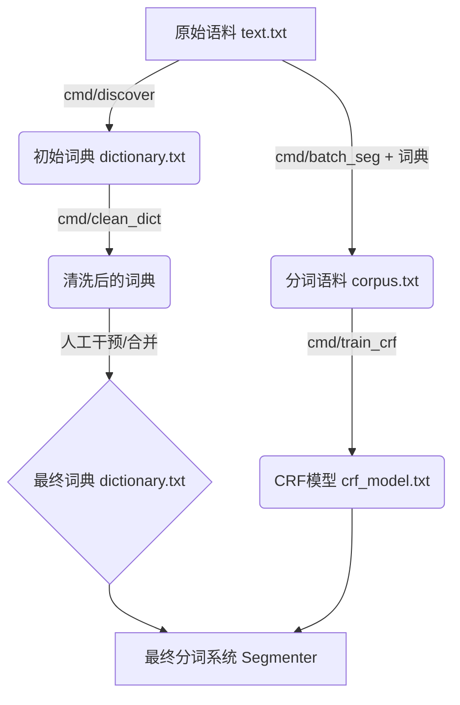

# teatak/seg 词库与模型训练指南

本指南详细介绍了如何从原始文本出发，构建和优化 `teatak/seg` 分词系统的词库及模型，以及如何实现持续的自动化迭代。

## 核心流程

整个训练流程是一个闭环迭代的过程：



## 步骤 1: 准备数据

将你收集到的无论是小说、新闻还是行业数据，保存为纯文本文件。
*   **路径**: `data/text.txt`
*   **格式**: 普通文本，UTF-8 编码。

## 步骤 2: 新词发现 (冷启动)

如果你还没有词典，或者想从语料中挖掘行业专有词汇，使用此工具。

```bash
# 从 text.txt 中发现高频词，生成初始词典
# -threshold: 词频阈值，低于此频率的词会被丢弃
go run cmd/discover/main.go -input data/text.txt -output data/dictionary.txt -threshold 5
```

## 步骤 3: 词典清洗与优化

自动发现的词典可能包含大量冗余词（如“丽怡酒”之于“丽怡酒店”）。使用清洗工具去除这些噪音。

```bash
# 清洗词典
go run cmd/clean_dict/main.go -input data/dictionary.txt -output data/dictionary_clean.txt

# (重要) 检查清洗结果后，覆盖回主词典
mv data/dictionary_clean.txt data/dictionary.txt
```

> **进阶技巧**：
> 1. 你可以手动创建一个高质量的 `base_dict.txt`（包含常用词、品牌名等）。
> 2. 将其与自动发现的词典合并：`cat base_dict.txt data/dictionary.txt | sort | uniq > data/dictionary_final.txt`

## 步骤 4: 生成训练语料

CRF 模型需要已分好词的句子作为“教材”。我们利用优化后的词典对原始文本进行大规模预分词。

```bash
# 使用词典对 text.txt 进行分词，生成 corpus.txt
go run cmd/batch_seg/main.go -input data/text.txt -output data/corpus.txt -dict data/dictionary.txt
```

*   **输入**: `data/text.txt` (原始文本)
*   **输出**: `data/corpus.txt` (词与词之间用空格隔开)

## 步骤 5: 训练 CRF 模型

利用生成的语料训练 CRF 模型，用于赋予分词器处理未登录词（OOV）的能力。

```bash
# 训练模型
# -iter: 迭代次数，建议 10-50 次，越多越准但越慢
go run cmd/train_crf/main.go -input data/corpus.txt -output data/crf_model.txt -iter 10
```

*   **输出**: `data/crf_model.txt`

## 步骤 6: 验证与测试

现在你已经拥有了最新的 `dictionary.txt` 和 `crf_model.txt`，可以使用 `cmd/seg` 进行测试。

**推荐使用 `-mode hybrid` (混合模式)**，它结合了词典的精准查词和 CRF 的智能推断。

```bash
# 测试特定句子
go run cmd/seg/main.go -mode hybrid "丽怡酒店的价格是否包含早餐"

# 交互式测试
go run cmd/seg/main.go -mode hybrid
```

## 自动化闭环迭代 (Continuous Improvement)

为了实现从“发现 Bad Case”到“模型更新”的秒级响应，我们提供了一个自动化脚本 `optimize.sh`。

### 1. 场景
当你发现分词器把某个词分错了（例如 "元宇宙" 被分成了 "元 / 宇 / 宙"），你不需要重走上面繁琐的步骤，只需一步。

### 2. 操作方法

1.  **准备新词文件**：将所有你想修复或新增的词写入一个文件（每行一个）。
    ```bash
    echo "元宇宙" > new_words.txt
    ```

2.  **执行自动化脚本**：
    ```bash
    ./scripts/optimize.sh new_words.txt
    ```

### 3. what happened?
该脚本会自动执行以下所有操作：
1.  **备份** 旧词典。
2.  **合并** 新词到 `data/dictionary.txt` 并赋予高频权重。
3.  **清洗** 词典，去除潜在冲突。
4.  **重分词** 全量重新生成训练语料。
5.  **重训练** 重新训练 CRF 模型以适应新词特征。
6.  **自测** 自动验证新词是否已被正确识别。

通过这个脚本，你可以实现**“上午发现问题，下午模型上线”**的敏捷迭代。

## 常见问题 (FAQ)

**Q: 即使在词典里加了词，分词还是切开了？**
A: 确保你使用的是 `-mode hybrid`。如果是 pure CRF 模式，它不看词典，只看模型预测，如果训练语料里没有这个词，模型很可能切错。

**Q: 如何让某些词强行不分开？**
A: 最有效的办法是将其加入 `data/dictionary.txt`，并赋予一个较高的频率（如 10000），然后使用 `-mode hybrid`。

**Q: 训练出来的模型准确率只有 15%？**
A: 这里的准确率是指“全句完全匹配率”。只要句子里错了一个字，整句就算错。对于长句，这很正常。字符级别的准确率通常远高于此。只要实际分词效果好即可。
